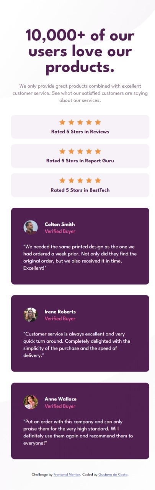
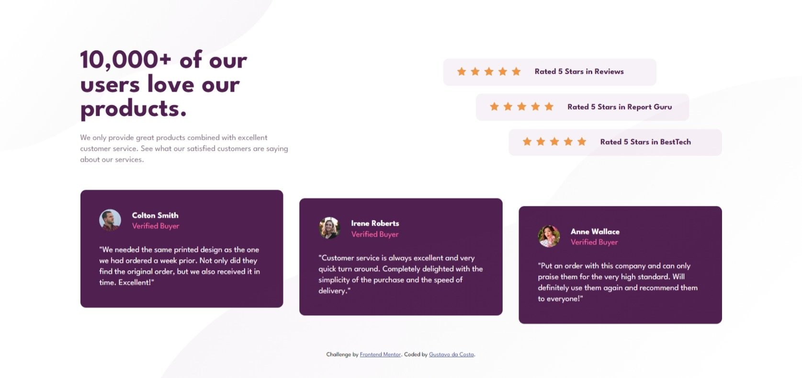

# Frontend Mentor - Social proof section solution - English

This is a solution to the [Social proof section challenge on Frontend Mentor](https://www.frontendmentor.io/challenges/social-proof-section-6e0qTv_bA). Frontend Mentor challenges help you improve your coding skills by building realistic projects. 

## Table of contents

- [Overview](#overview)
  - [The challenge](#the-challenge)
  - [Screenshots](#screenshots)
  - [Links](#links)
- [My process](#my-process)
  - [Built with](#built-with)
  - [What I learned](#what-i-learned)
  - [Useful resources](#useful-resources)
- [Author](#author)

## Overview

### The challenge

Users should be able to:

- View the optimal layout for the section depending on their device's screen size

### Screenshots




### Links

- Solution URL: [Click here](https://gugup4ulino.github.io/social-proof-section/)

## My process

### Built with

- Semantic HTML5 markup
- CSS custom properties
- Flexbox
- CSS Grid
- Mobile-first workflow

### What I learned

I learned a lot about the postion behavior of elements - relative and absolute. I had a lot of difficulty aligning the background images and configuring the layout of the main content. However, by doing several tests, I was able to learn from my mistakes and achieve the result.

```css
body {
    position: relative;
    font-size: var(--font-size-body);
}

#bg-top, #bg-bottom {
    position: absolute;
    background-size: 100% 100%;
    background-repeat: no-repeat;
    width: 100%;
}
```
With this project, I finally learned how to use flex and grid displays. I used a lot of its properties to manipulate the elements. I tried to use both types of display to have them in my repertoire and to identify their individual characteristics. I'm sure this will help me in future projects, to better choose which display to use on each occasion.

```css
aside {
    display: flex;
    flex-direction: column;
    align-items: center;
    gap: 1em;
    margin: 2em 0em 2em auto;
}

.comments {
    display: grid;
    grid-template-columns: 50px 1fr;
    grid-template-rows: 25px 25px 1fr;
    border-radius: 10px;
    max-width: 26em;
    margin: 0 auto;
    padding: 35px;
    background-color: var(--very-dark-magenta);
}
```

I think it's worth highlighting that I had the project almost ready, just adapting it for mobile, when several problems arose related to the position of the body, the background images and the main. This made me give up and start again, but this time, trying the mobile-first workflow. And it ended up working out in the end.

### Useful resources

- [Video 1](https://www.youtube.com/watch?v=phWxA89Dy94) - This video helped me understand the flexbox model and use its properties.
- [Video 2](https://www.example.com) - This video helped me understand the Grid Layout and use its properties.
- [Vídeo 3](https://youtu.be/MxEtxo_AaZ4?si=hv8fhef_T_CeDUxA) - This video helped me understand the position property of elements.

## Author

- Instagram - [@gustavoodacosta_](https://www.instagram.com/gustavoodacosta_)
- Frontend Mentor - [@yourusername](https://www.frontendmentor.io/profile/GuguP4ulino)

# Frontend Mentor - Solução Social proof section - Português

Esta é uma solução para o [desafio Social proof section do Frontend Mentor](https://www.frontendmentor.io/challenges/social-proof-section-6e0qTv_bA). Os desafios do Frontend Mentor ajudam você a melhorar suas habilidades de codificação criando projetos reais.

## Índice

- [Visão geral](#visão-geral)
  - [O desafio](#o-desafio)
  - [Capturas de tela](#capturas-de-tela)
  - [Links](#links)
- [Meu processo](#meu-processo)
  - [Feito com](#feito-com)
  - [O que aprendi](#o-que-aprendi)
  - [Recursos úteis](#recursos-úteis)
- [Autor](#autor)

## Visão geral

### O desafio

Os usuários devem ser capazes de:

- Ver o layout ideal para a seção dependendo do tamanho da tela do dispositivo.

### Capturas de tela


### Links

- URL da solução: [Clique aqui](https://gugup4ulino.github.io/social-proof-section/)

## Meu processo

### Feito com

- Marcação HTML5 semântica
- Propriedades personalizadas de CSS
- Flexbox
- CSS Grid
- Fluxo de trabalho mobile-first

### O que aprendi

Aprendi bastante sobre o comportamento da posição dos elementos - relative e absolute. Tive bastante dificuldade para alinhar as imagens do background e configurar o layout do conteúdo principal (main). Porém, fazendo diversos testes, pude aprender com meus erros e atingir o resultado.

```css
body {
    position: relative;
    font-size: var(--font-size-body);
}

#bg-top, #bg-bottom {
    position: absolute;
    background-size: 100% 100%;
    background-repeat: no-repeat;
    width: 100%;
}
```
Com esse projeto, finalmente aprendi a usar os display flex e grid. Utilizei muito das suas propriedades para manipular os elementos. Busquei utilizar os dois tipos de display para tê-los no meu repertório e para identificar suas características individuais. Tenho certeza que isso irá me auxiliar nos próximos projetos, para escolher melhor qual dos display usar em cada ocasião.

```css
aside {
    display: flex;
    flex-direction: column;
    align-items: center;
    gap: 1em;
    margin: 2em 0em 2em auto;
}

.comments {
    display: grid;
    grid-template-columns: 50px 1fr;
    grid-template-rows: 25px 25px 1fr;
    border-radius: 10px;
    max-width: 26em;
    margin: 0 auto;
    padding: 35px;
    background-color: var(--very-dark-magenta);
}
```

Acho legal destacar que eu estava com o projeto quase pronto, apenas adaptando para mobile, quando surgiu diversos problemas relacionados ao position do body, as imagens do background e o main. Isso me fez desistir e começar de novo, mas dessa vez, primeiro pelo mobile (mobile-first workflow). E acabou que deu certo no final.

### Recursos úteis

- [Vídeo 1](https://www.youtube.com/watch?v=phWxA89Dy94) - Este vídeo me ajudou a entender o modelo flexbox e usar suas propriedades.
- [Vídeo 2](https://www.example.com) - Este vídeo me ajudou a entender o Grid Layout e usar suas propriedades.
- [Vídeo 3](https://youtu.be/MxEtxo_AaZ4?si=hv8fhef_T_CeDUxA) - Esse vídeo me ajudou a entender a propriedade position dos elementos.

## Autor

- Instagram - [@gustavoodacosta_](https://www.instagram.com/gustavoodacosta_)
- Frontend Mentor - [@GuguP4ulino](https://www.frontendmentor.io/profile/GuguP4ulino)